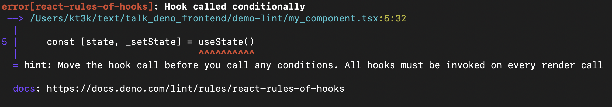

class: middle center


# Deno Update:

## 最近のフロントエンド向け機能

---

## Yoshiya Hinosawa


- x.com / github - @kt3k
- Web エンジニア。
- 2021年から Deno Land 社メンバー。最近は Standard Library と Node 互換性周り担当

---
class: center inverse

# <br/>

Deno ってサーバーサイドは気持ちよく使えるけど、<br />フロントエンドやろうとすると厳しいよね


--

それはそう


--

でも


--

最近かなり改善してきてます

---

## トピック

- フロントエンドの型の話 <!-- React の型付け、workspace の型付け -->
- フロントエンドのリントの話　<!-- Rules of hooks, JS Plugin -->
- フロントエンドのフォーマッターの話 <!-- CSS / HTML /  -->

---
## React の型付け

とりあえず deno のコードに JSX を書くと型エラーになってしまう。


--

ので、deno では react の型チェックは出来ないと思ってしまいがち


--

実はきちんと型をつけるための設定があります。

---
## React の型付けのレシピ

- jsxImportSource
  - JSX のランタイムを指定
- jsxImportSourceTypes (Deno v1.46 で追加 🆕)
  - JSX のランタイムの型を指定
- ts-types
  - npm パッケージの型を指定

---

## React の型付け

```js
/** @jsxImportSource npm:react@^19.0.0 */
/** @jsxImportSourceTypes npm:@types/react@^19.0.0 */

// @ts-types="npm:@types/react@^19.0.0"
import { useState } from "npm:react@^19.0.0";

function Component() {
  const [val, setVal] = useState(0);

  return <div>count {value}</div>;
}
```

<small>(注: 1ファイルで全部設定する場合)</small>

---

## React の型付け

deno.json を使う場合

```json
{
  "compilerOptions": {
    "jsx": "react-jsx",
    "jsxImportSource": "npm:react@^19.0.0",
    "jsxImportSourceTypes": "npm:@types/react@^19.0.0"
  }
}
```
---

## React の型付け

deno.json と import map を使う場合

```json
{
  "compilerOptions": {
    "jsx": "react-jsx",
    "jsxImportSource": "react",
    "jsxImportSourceTypes": "@types/react"
  },
  "imports": {
    "react": "npm:react@^19.0.0",
    "@types/react": "npm:@types/react@^19.0.0"
  }
}
```

---
## React の型付け

先の deno.json を使うとこう書ける

```js
// @ts-types="@types/react"
import { useState } from "react";

function Component() {
  const [val, setVal] = useState(0);

  return <div>count {value}</div>;
}
```

---
## React の型付け、余談

```js
// @ts-types="@types/react"
import { useState } from "react";
```

この `@ts-types="@types/react"` の部分を書かなくても自動で探してこれるようにしようという議論があります。

[denoland/deno#27569](https://github.com/denoland/deno/issues/27569)

---
## Deno の型と環境

Deno はデフォルトで、Deno 環境に対して型チェックする。

deno.json の compilerOptions.lib という設定を変えると、Deno 以外の環境の型チェックが出来る

---
## Deno の型と環境

ブラウザの型チェックをする設定

```json
{
  "compilerOptions": {
    "lib": [
      "esnext",
      "dom",
      "dom.iterable"
    ]
  }
}
```

---
## Deno の型と環境

deno.json で型を変えるとプロジェクト全体に影響してしまう


--
1プロジェクトに、例えば、フロントエンドとバックエンドが混在している場合、うまく設定する方法がなかった


---

## Workspace 別の型定義

Deno 1.45 から Workspace が使えるようになっている

```json
{
  "workspace": [
    "./foo",
    "./bar"
  ]
}
```

---

## Workspace 別の型定義

さらに 2.2 から型の設定をワークスペース毎に変えることができるようになった

---

./backend/deno.json
```json
{
  "compilerOptions": {
    "lib": ["esnext", "deno.ns", "deno.globals"]
  }
}
```

./frontend/deno.json
```json
{
  "compilerOptions": {
    "lib": ["esnext", "dom"]
  }
}
```

---

注: Deno 2.2 は本日(2/17)時点では未リリースのため、今すぐ試したい場合はカナリーを使ってください

```
deno upgrade --canary
```

---
class: middle center inverse

フロントエンドで使えるリントの話


---
class: middle center inverse

deno lint は Rust で書かれた高速なリンターですが、<br />フロントエンド系のルールがないのが弱点でした


---

## Rules of Hooks

Deno 2.2 から [Rule of Hooks](https://react.dev/reference/rules/rules-of-hooks) が `deno lint` でチェックできるようになりました🎉

---

## Rules of Hooks

```js
// Good
function Foo() {
  const [state, useState] = useState();

  return <span>{state}</span>
}
```
---

## Rules of Hooks

```js
// Bad
function Foo() {
  if (cond) {
    const [state, useState] = useState();
    return <span>{state}</span>
  }
  return null;
}
```

--


---

## その他 React 向けリントルール

- jsx-boolean-value
- jsx-curly-braces
- jsx-key
- jsx-no-children-prop
- jsx-no-comment-text-nodes
- jsx-no-danger-with-children
- jsx-no-duplicate-props
- jsx-no-unescaped-entities
- jsx-no-useless-fragment
- jsx-props-no-spread-multi
- jsx-void-dom-elements-no-children

---

## React 向けリント設定

React 向けのリントルールはデフォルトで有効化されていないので、deno.json で以下の設定をしてください

```json
{
  "lint": {
    "rules": {
      "tags": [
        "recommended",
        "react"
      ]
    }
  }
}
```


---
class: inverse middle center

カスタムリントルール

---

## カスタムリントルール

Deno 2.2 からカスタムなリントルールを JS で書けるようになりました。

```js
export const MyRule = {
  create: (ctx) => ({
    Identifier(node) {
      if (node.name !== "a") return;
      ctx.report({ node, message: "should be b" });
    },
  })
}
```

---

## カスタムリントルール

- ESLint とほぼ互換な記述方法でリントルールをかけます
- フレームワーク固有、チーム固有なルールを JS/TS で書ける

---

## カスタムリントルール

書いたルールを公開・シェアすることも可能

```json
{
  "lint": {
    "plugins": [
      "./plugins/my-plugin.ts",
      "jsr:@deno/lint-plugin1",
      "npm:@deno/lint-plugin2"
    ]
  }
}
```
---

## カスタムリントルール

- リリースされたばかりなので、現状はまだすぐ使えるリントルールは無い
- 今後需要の高い ESLint ルールが移植されてエコシステム化することが期待できる

---
class: middle inverse center

フロントエンドで使えるフォーマッターの話

---

## フォーマッタの追加

- Deno 1.46 から CSS / HTML がフォーマットできるようになっています。
- 特殊な設定なしで、`deno fmt` コマンドが .css .html ファイルを検出してフォーマットします。

---
## CSS フォーマッター

- LESS / SCSS / SASS にも対応

<small>styled-component のような JS 内に書くタイプの CSS はまだ未対応</small>

---

## HTML フォーマッター

- Nunjucks (.njk) と Vento (.vto) というテンプレート言語もフォーマットされる

---
## HTML フォーマッター

- --unstable-component というフラグをつけると、Vue (.vue), Svelte (.svelte), Astro (.astro) のファイルがフォーマットできる

---
class: middle center inverse

おまけ


---
## 現在開発中の機能

- JS の中の CSS のフォーマット
  - 例. emotion, styled-component
- @types/ の自動検出

---
class: center inverse

# <br />

Deno はフロントエンド向けの機能を絶賛開発中


---
class: center inverse

# <br />

フロントエンドの機能は非常に多様

--

Deno でどういうシナリオがサポートされるべきかは Deno チームも模索中

--

ユーザーの要望が多い機能ほど入る傾向があります

---
class: center

# <br />

これは出来ないのか? という疑問を抱いた場合は<br/>ぜひ issue を投げてください

## [github.com/denoland/deno/issues](https://github.com/denoland/deno/issues/new/choose)

---
class: center

# <br />

もしくは<br />

## deno-ja slack #question

で質問してみてください


ご清聴ありがとうございました 🙇‍♂️
